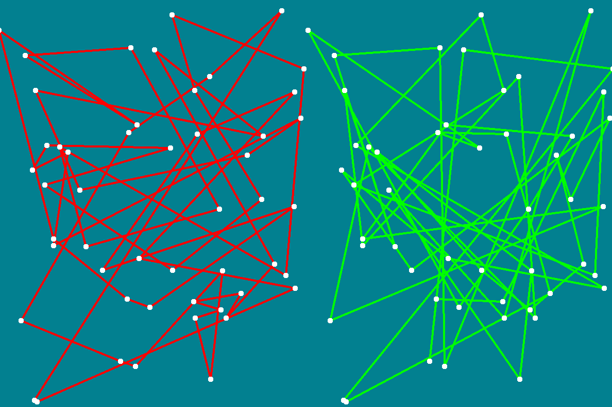

# TSP Algorithms
Solving the traveling salesman problem using different heuristic approaches. Visualized using SFML. 
## Preview
Solving TSP for n=50 using the genetic algorithm (slowed down to look nicer)

## Algorithms
Currently, there are 3 different heuristic algorithms implemented for solving TSP:
#### 1. Ant colony simulation
Ant colony simulation takes inspiration from the natural behavior of ants searching for food. 
Ants move freely through the graph starting at a source node and making a tour. 
As they move they lay down pheromones whose strength is inversely proportional to the length of their tour. 
When an ant picks the next node to visit the probability of visiting each node is proportional to pheromone
strength on the connecting edge. 
References:  
Dorigo et al. (2006)Ant Colony Optimization: [link](https://www.researchgate.net/publication/308953674_Ant_Colony_Optimization)

#### 2. Simulated annealing
The "Simulated annealing" method vaguely resembles annealing or forging metal. 
The metal is first heated to some temperature at which it is malleable,  
then it cools exponentially and becomes harder to deform - holding its new shape. 
The algorithm follows a similar pattern at first we choose a starting temperature, and take some starting permutation.  
At each step, we look at neighboring states of the current state (permutation) and compute their path lengths. 
If we find a better solution we accept it and continue the local search.  
Else we accept the worse solution with some probability  
(dl being the difference in path length, c being a probability constant and T the temperature) 
After the local search is completed, the temperature is reduced and the algorithm is repeated either until there are no changes made or the temperature reaches a very low point. 
References:  
S.Kirkpatrick et al. (1983) "Optimization by Simulated Annealing": [link](https://science.sciencemag.org/content/220/4598/671)

#### 3. Genetic algorithm

